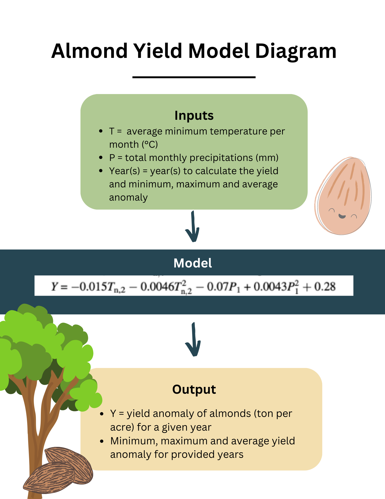

```{r setup, include=FALSE}
library(tidyverse)
library(here)
```




## Running a Function to Calculate Almond Yied
### Loading in the Data

```{r loading the data}

# reading in the text file
data <- read.table(here("clim.txt"), header = TRUE)

```

### Running the function with default years

```{r running the function}

# sourcing the function from the R project
source("almond_yield.R")

# running the function with the default years
default_anomaly <- almond_yield(climate_data = data)


# printing the results
kableExtra::kable(default_anomaly, align = "c") |> 
  kableExtra::kable_styling(bootstrap_options = "striped", 
                            full_width = FALSE)

```

### Running the function years other than the default years

```{r}

# running the function and inputting new years
year3_anomaly <- almond_yield(years = c(2000:2003), climate_data = data)


# printing the results
kableExtra::kable(year3_anomaly, align = "c") |> 
  kableExtra::kable_styling(bootstrap_options = "striped", 
                            full_width = FALSE)

```

